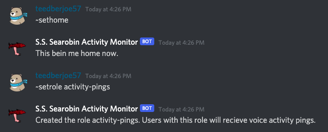

## Discord Voice Activity Monitor

### Want to get pings when someone is sitting in voice chat alone? Look no further.

<hr>

### What does this bot do?
* The voice activity monitor sends a ping (to users who have opted in) when someone joins a voice chat channel alone.
* If you follow a server closely and never want to miss out on the action then this bot is for you.
* If you follow a dead server that rarely has any action then this bot is also for you. Never miss out on the fun.
* This voice activity monitor makes sure you always know when people are chilling in vc.

<br>

### Get Started
* Invite the bot to your server and get started.
* You can invite the bot to any server that you administrate.
* [Add the bot to your server using this link](https://discord.com/api/oauth2/authorize?client_id=720779074129231894&permissions=369306688&scope=bot)

<br>

### How to use?
* There are 2 commands to get started with the voice activity monitor.
  1. ```~sethome```: Send this command in the channel that you want the bot to send messages in
  2. ```~setrole <rolename>```: Send this command to tell the bot to create a named role. This is the role that the bot will @ mention whenever it detects voice activity. Users can add this role to themselves to recieve voice activity pings. The bot will ping @here by default if no role has been set.

<br>

Example setup:
<br>
