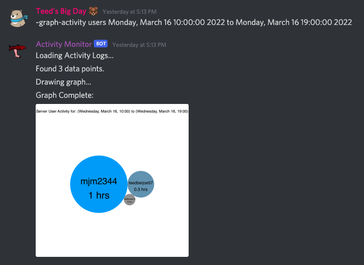

## Discord Voice Activity Monitor


### Want to get pinged when the voice chat gets active? Look no further.

<hr>

### What does this bot do?
* The voice activity monitor pings users when someone joins a voice chat channel alone.
* If you follow a server closely and never want to miss out on the action then this bot is for you.
* If you follow a dead server that rarely has any action then this bot is also for you. Never miss out on the fun.
* This voice activity monitor makes sure you always know when people are chilling in vc.


### Get Started
* [Add the bot to your server using this link](https://discord.com/api/oauth2/authorize?client_id=720779074129231894&permissions=278066293824&scope=bot)
* You can invite the bot to any server that you administrate.


### Command Docs 
* ```~sethome```
  * Sets the current channel as the bot's home. The bot will only send messages to its home channel.

* ```~setrole <Rolename>```
  * Creates a new role named "\<Rolename>" that the bot will send pings to.
  * Only users who are assigned to this roll will recieve pings for voice acitivity changes.

* Example setup:
  <br>
  

* ```~graph-activity <Graph> <DateRange>```
  * Creates a visualization of server voice chat activity from the given date range and sends it back as an image.
  * Params:
    * ```<Graph>```: This should be one of the following avaliable visalizations: "users", "server"
    * ```<DateRange>```: This should be either a date range flag or two dates seperated by "to"
      * Avaliable date range flags are:
        * past-minute
        * past-hour
        * past-day
        * past-week
        * past-month
        * past-year
        * all-time
      * Example date range:
        * "Monday, March 14 16:00:00 2022 to Monday, March 14 19:00:00 2022"
        * Date ranges are parsed by the javascript date builtin. It can figure out most common date formats. It's best to provide it with a year in all cases.

* Example graphs with date range:
  <br>
  
  <br>
  
    
<br>

### Data privacy statement
* I want to be fully transparent that this bot does passively collect voice chat activity data. This data is stored securely and is only used for the commands that generate user activity graphs for your server. I will never sell or intentionally expose the data collected through this app.
* Here's a description of the data that this bot collects: 
  * IDs of users on a voice channel when activity is detected.
  * The server ID and channel ID
  * A time stamp of when the activity was detected.
  * Activity is detected only when a user joins or leaves a voice channel.